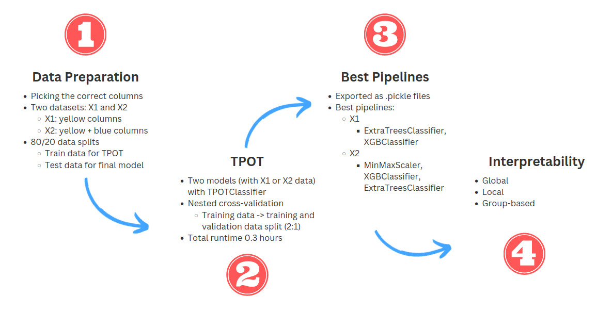

# Explainable Automated Framework for Predicting the Risk of Major Adverse Cardiac Event (MACE)
Project 2 for the 'Explainable Automated Machine Learning' (LTAT.02.023) course.

## Team
Marilin Moor  
Dmitri Rozgonjuk  
Jure Vito Srovin  
Lisanna Lehes  
Allan Mitt

## Project Objective
This project aims to use AutoML to predict clinical outcomes using imaging and clinical variables. The imaging modality of interest is positron emission tomography (PET). The outcome of interest to predict is major adverse cardiac event (MACE) with heart failure. The more specific goals are (1) finding the best machine learning pipelines (using the [TPOT framework](https://github.com/EpistasisLab/tpot)) for models based on two datasets with best weighted F1-scores, and (2) applying interpretability techniques (using the [SHAP framework](https://shap.readthedocs.io/en/latest/index.html)) to provide insights into the black-box models in order to explain the major drivers of predictions on a global, local as well on a group level.

## Project Workflow
The general project workflow is presented in Figure 1.

We first started with selecting the appropariate data. We aimed to search for the best pipelines in two data sets: one that included less features (the 'yellow' columns; X1), and the other that included additional features ('yellow' + 'blue' columns; X2). After data extraction, we split the total dataset into training and test data with❗ XX/XX split. The test data were kept separately to compute the goodness of the best pipeline which, in turn, was searched for with the TPOT framework. After the TPOT framework provided the best pipelines, we used them (i.e., for both X1 and X2 data) in interpretability frameworks. Model interpretability was provided on global (feature importances, SHAP summary plot), local (SHAP force_plot) as well as group (local explanation methods are used and aggregated for a certain group) levels. We extended some previously-produced software (SHAP) to include more customization in providing interpretability views.

## Files and Directories
- `tpot_models/`: directory that includes the python files for TPOT models (results)
  - `tpot_X1.py`: results for Model 1 (less features)
  - `tpot_X2.py`: results for Model 2 (more features)
- `README.md`: the present file that includes the project meta-information
- `autosklearn_approach.ipynb`: a notebook where we initially tried to implement the `auto-sklearn` approach; not used in the final solution.
- `interpretability.ipynb`: a notebook that includes the interpretability part; pre-requisite is the existence of TPOT model files
- `requirements.txt`: python packages for installing
- `tpot_approach.ipynb`: a notebook with the TPOT implementation as the automated ML approach

## How to Run
Although the present projects includes relatively extensively computed solutions, it is also possible to run the models with self-defined (hyper-)parameters. For that, one needs to **first run the scripts in the `tpot_approach.ipynb` notebook** which **prepares the data and runs the TPOT framework**. Once the computations are done, the `.py` files for the best pipelines for datasets `X1` and `X2` are produced. Then, one needs to **continue with the `interpretability.ipynb` notebook** where the models are imported and **interactive interpretability** approach can be executed. We kept these approaches in separate notebooks for more clarity, as in both cases, running the scripts in notebooks can be time-consuming.

